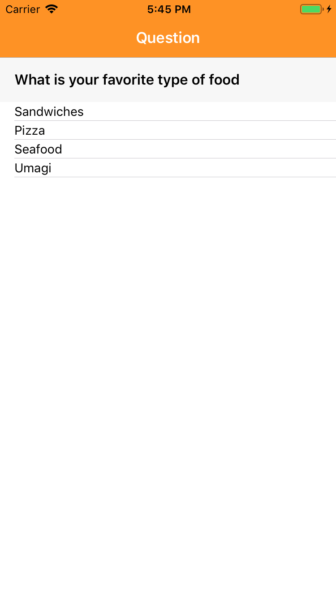
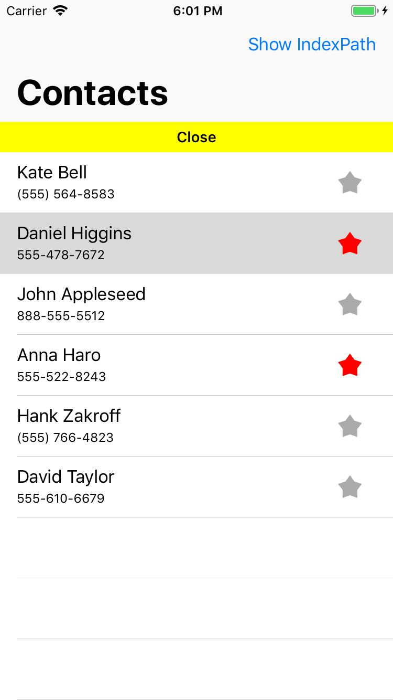

# iOS-Swift
iOS features/small Apps

**Concept**: by switching to various branches explore all kinds of features/smallApps/researches. 

# Master
Initial blank app

# Features
    
  - CircleProgressBar
  
    Circular pulsing ProgressBar showing download completion from specific API call.
    
    

    
    
    

    
  - PropertyAnimator
  
    Usage fractions of property animatior with bluer and scale effect.
    
    

    
    
    

    
  - SwipingPage
  
    Basic swiping horizontal collection view.
    
    

    
    
    
    

    
  - MagicGrid
  
    Animated magic grid.
    
    

    
    

    
  - QRMaster
    
    Simple QR generator and scanner.

    

    
    
    
    
    

    
    
    

    
    

    
  - MapKitPins
    
    Basic search and pining on map.
    
    

    
    

  
  - DrawingCanvas
   
     Utilizing drawing with custom canvas and some functionalites.
     
    

    
    

    
  - SimpleBarCharts
  
    

    
    

    
  - FBStreamAnimation
   
     FB stream animation on specific Bazieth path.
     
    

    
    
 	
    
  - QuestionLikeTableView
   
    TableView with question and navigation for stages.
   
    

    
    
    
    

    
  - PhoneListTableView
   
    Presenting user phone calls with like abilities.
     
    

    
    

    
  - LeftSlideAnimations
   
    Chain animations to the letft.
     
    

    
    
    
    

    
  - AirplaneSeats

    Simple collection view presenting airplane seats. 

    

    
    
 
